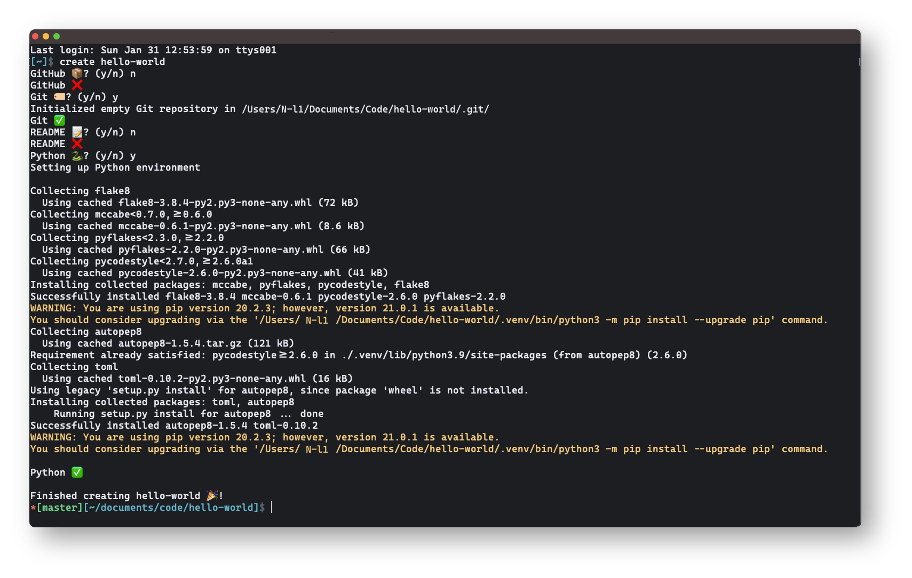

# New Project

My new project workflow, scripted with ZSH:

1. Creating a new project folder
2. Publishing on GitHub with README & license
3. Set up virtual environment when using Python
4. Open VSCode
5. Done!

