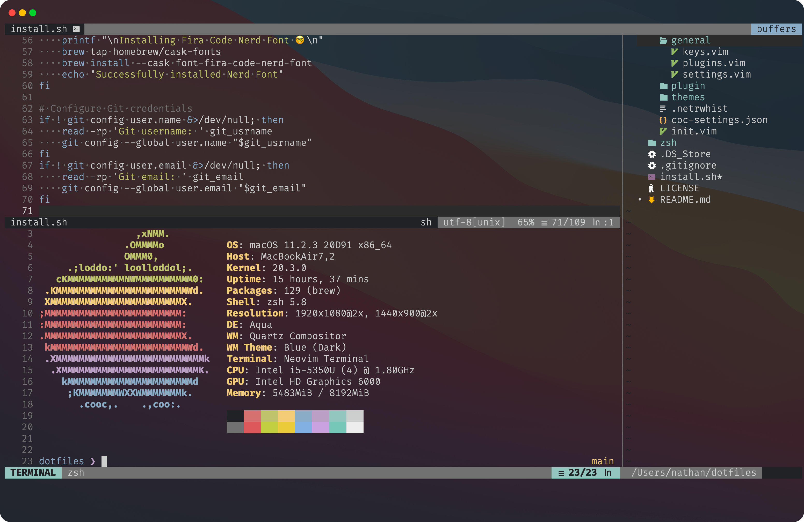

# .*dot*files.

```shell
cd && git clone https://github.com/ilzq/dotfiles.git
```

```shell
cd dotfiles && ./install.sh
```



## Overview

- **Shell**: [`ZSH 🚀`](/zsh)
- **Editor**: [`Neovim ⌨️`](/nvim)
- **OS**: `Mac || WSL ✨`
- **Terminal**: [`Alacritty 💨`](/alacritty)

