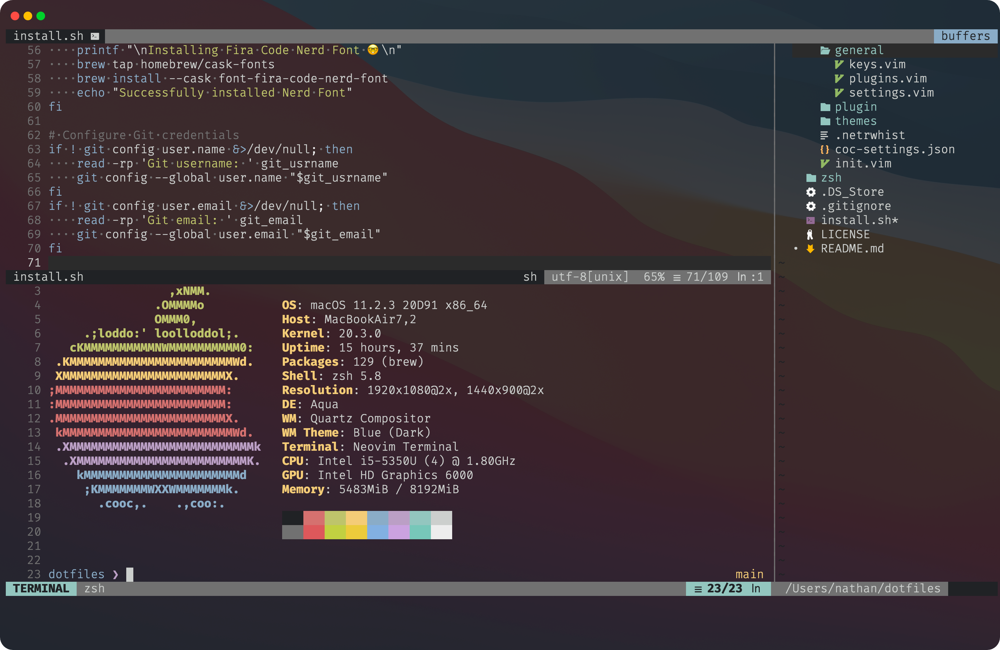

# .*dot*files.

```shell
# Install
cd && git clone https://github.com/qiz-li/dotfiles.git && ./dotfiles/install/install.sh && zsh
```



- [`claude-code`](https://github.com/anthropics/claude-code) - Anthropic's CLI for Claude
- [`ghostty`](https://github.com/ghostty-org/ghostty) - Fast, native terminal emulator
  - [`ayu`](https://github.com/ayu-theme/ayu-colors) - Simple, bright, and elegant theme
- [`git`](https://github.com/git/git) - The version control system
- [`gpg`](https://github.com/gpg/gnupg) - GNU tool for PGP encryption, currently used for Git commit signing
- [`keyboard`](keyboard/com.local.KeyRemapping.plist) - Caps Lock remapped to Escape at login
- [`neovim`](https://github.com/neovim/neovim) - Vim-fork focused on extensibility and usability
  - [`lazy.nvim`](https://github.com/folke/lazy.nvim) - Modern plugin manager for Neovim
    - [`ayu`](https://github.com/ayu-theme/ayu-vim) - Ayu theme, Vim edition
    - [`commentary`](https://github.com/tpope/vim-commentary) - Quick and easy way to comment stuff out
    - [`fugitive`](https://github.com/tpope/vim-fugitive) - Awesome Git wrapper for Vim
    - [`gitgutter`](https://github.com/airblade/vim-gitgutter) - Git diff markers in Vim gutter
    - [`goyo`](https://github.com/junegunn/goyo.vim) - Zen mode in Vim
    - [`limelight`](https://github.com/junegunn/limelight.vim) - Focus-enhancing text highlighting
    - [`lspconfig`](https://github.com/neovim/nvim-lspconfig) - Quickstart configs for Neovim's built-in LSP
    - [`mason`](https://github.com/williamboman/mason.nvim) - Portable package manager for LSP servers
    - [`polyglot`](https://github.com/sheerun/vim-polyglot) - Solid language pack for syntax highlighting
    - [`surround`](https://github.com/tpope/vim-surround) - Quickly and easy way to surround stuff with quotes, brackets+
- [`pandoc`](https://github.com/jgm/pandoc) - Universal document converter
  - [`wr`](pandoc/wr.sh) - Custom Markdown <-> DOCX conversion script
- [`nvm`](https://github.com/nvm-sh/nvm) - Node Version Manager
  - [`node`](https://github.com/nodejs/node) - Server-side JavaScript runtime environment
  - [`npm`](https://github.com/npm/cli) - The package manager for JavaScript
- [`zsh`](https://github.com/zsh-users/zsh) - Powerful interactive shell and scripting interpreter
  - [`zinit`](https://github.com/zdharma-continuum/zinit) - Fast Zsh plugin manager with turbo mode
    - [`autosuggestions`](https://github.com/zsh-users/zsh-autosuggestions) - Useful auto-completion based on history
    - [`common`](https://github.com/jackharrisonsherlock/common) - Simple and clean Zsh prompt
    - [`feeling`](https://github.com/qiz-li/feeling) - Feelings calendar
    - [`history-substring-search`](https://github.com/zsh-users/zsh-history-substring-search) - Fish-like helpful command history search
    - [`syntax-highlighting`](https://github.com/zsh-users/zsh-syntax-highlighting) - Fish-like beautiful syntax highlighting
    - [`you-should-use`](https://github.com/MichaelAquilina/zsh-you-should-use) - Helpful alias suggestions
  - [`zoxide`](https://github.com/ajeetdsouza/zoxide) - Quick directory navigation that learns off history
  - [`fzf`](https://github.com/junegunn/fzf) - Command-line fuzzy finder

> Readme format heavily inspired by [`@kutsan`](https://github.com/kutsan)/[`dotfiles`](https://github.com/kutsan/dotfiles)
